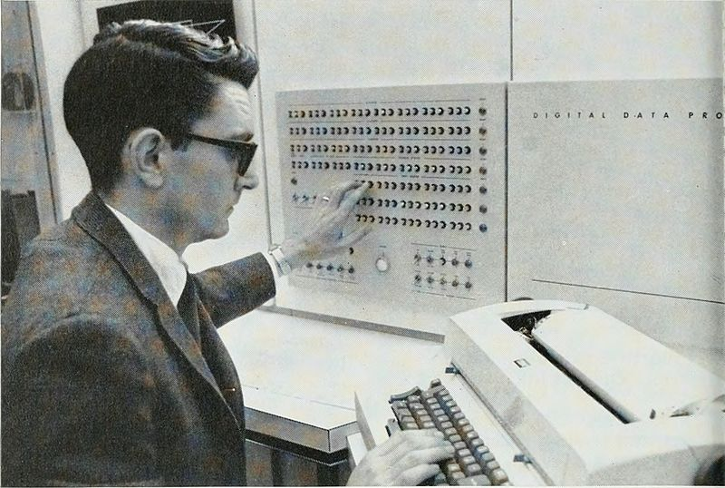
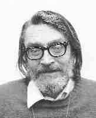
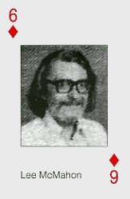
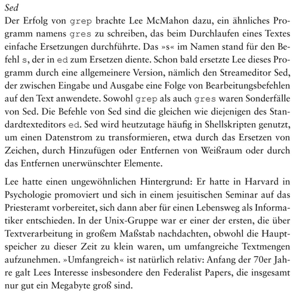
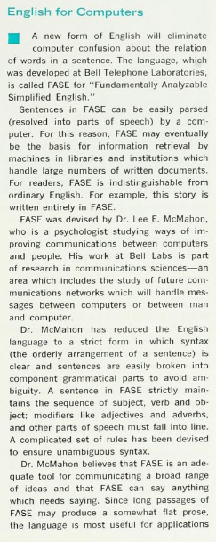
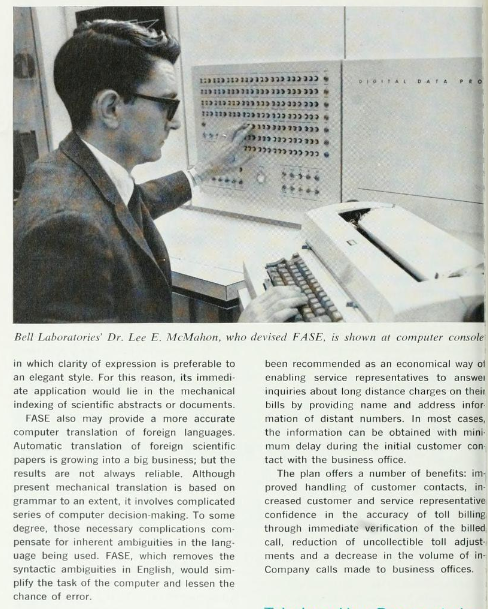

# Lee E. McMahon

This document attempts to gather and present publicly available information about
Lee E. McMahon. It is intended honor his accomplishments and preserve his legacy
while remaining as unbiased as possible.

## Reconstructed CV

1931: Born Lee E. McMahon - **citation needed** + **Middle name needed**

???: Marries Helen G ([maybe maiden name Grogan][31]) McMahon [inferred from newspaper][20] - **citation needed**

???: Children Michael & Catherine [inferred from newspaper][20] - **citation needed**

1949: [St. Louis University High Alumni][22] (Catholic, Jesuit college-preparatory school)

???: Graduates from Saint Louis University - **citation needed**

~1960-1970: [McMahon Pairing][10] [created by Lee][18] [most likely in the New York go club][25]

1963: [Phd at harvard for Psychology][23] - Topic: [Grammatical analysis as a part of understanding a sentence][24]

~1963: Jesuit seminar [according to Brian Kernigham][27] - **additional citation needed, not mentioned elsehwere**

1963: Starts working at Bell labs - **citation needed**

1966: Works on [FASE][19] - multiple articles and papers published

1976: [Work on the authorship of the Federalist papers][8]

197X-198X: [Work on comm, qsort, sed, the current grep, and the concordance-builders index for English and cref for C][4]

198X: [Work on datakit][4] [additional datakit references][21]

198X: Develops [throat cancer][11] (most likely ~1980-1986 by cross referencing with [Gary James Murakami CV][26])

1989: Stops working at Bell labs - **citation needed**

1989: Death (can not be verified in [New Jersey][30]) - **citation needed**

## Pictures

These are the only 3 images currently directly attributed to Lee.



Image depicting Lee in [1966.][19]



Widely available image commonly referred to as [lemsmall.jpg][29]



Playing card depicting Lee - most likely available in [1994][15] and part of a [full set][16]


## Citations

```
"A while later a demand arose for another special-purpose
program, gres, for substitution:  g/re/s.  Lee McMahon
undertook to write it, and soon foresaw that there would be
no end to the family:  g/re/d, g/re/a, etc.  As his concept
developed it became sed, a tool of remarkable utility that
is largely unappreciated today, because it capitalizes on
the perfect familiarity with ed that was universal ten years
ago, but no more.  Sed covers a lot of needs.  For example,
we have never seen fit to adopt the widespread `head'
utility because `sed 10q' does just as well."(44)
```

Source: [Early Unix History][3]

```
The third project was Bob Morris and Lee McMahon’s work
on the authorship of the Federalist papers. Working with the
ideas of statistician Fredrick Mosteller, Morris and McMahon were
trying to determine who wrote which paper using statistical
analysis. "Taking turns typing," they entered the
papers into the machine to run them through various filters and
counters. They "developed lots of tools for processing text
in the process." Typo, for example, was "one of the
early spell-checkers." It worked based on trigram
statistics, a Mosteller technique that analyzed chunks of
repeated letters. Cherry’s familiarity with trigram
statistics had come from a compression project she worked on in
1976. She describes the process:

You take the whole string, if your ten-letter work had maybe a
trigram that was six letters long that had a high enough count
to be worthwhile, you pick that entire six-letter string off
and store it in a dictionary and replace it with a byte and then
with an index into the dictionary.

This counting procedure was applied to the other forms of
analysis, for example, the Federalist papers authorship research.
```

Source: [Oral Unix History][8]

```
At ManorCare in New Providence, my father-in-law Arne
Swenson sits with Gertrude and Helen for meals. I
eventually found that Helen's last name is McMahon,
 and being a Bear's fan, I mentioned Jim McMahon of
Chicago Bears and Superbowl Shuffle fame. Helen told
me that her husband's name was Lee, and I told her
that I had a coworker at Bell Labs named Lee McMahon.
I found a photo via Google images, and she said "That's him!"

I worked with Lee McMahon and Bill Marshall on Datakit,
a computer network invented by Sandy Fraser in Computer
Science Research at Bell Labs Murray Hill. In my mind,
I can still picture Lee and Bill in the "Wurlitzer" room
which was adjacent to the Unix room in building 2, fifth
floor. It was called the Wurlitzer room because the layers
of consoles for the Datakit switches resembled a massive
organ. Lee and Bill stood at the center of it all.

I can still picture Lee standing in my office doorway to
chat about work. He was a chain smoker and would tap ashes
into the door latch hole. When I poked him about it he
said that there was no problem since the door jamb and
walls were all steel. I still wondered at the surprise
of a column of ashes for workers doing any remodeling. Lee
got throat cancer and a laryngectomy. He returned to work
after treatment, and I remember the shock and sympathetic
pain that I felt for him as he struggled to speak. We
resorted to communicating via pen and paper. Looking back,
I can see the interest and effort that he took to encourage
me professionally and personally - what a great guy!
```

Source: [Blog entry][11]

```
Lee E. McMahon’s linguistic insight fostered the characteristic
text-processing—as distinct from-text-formatting—capabilities of
the system. He wrote comm, qsort, sed, the current grep, and the
concordance-builders index for English and cref for C. After an
early fling with cu and an influential laboratory switching system
done with Condon, Morris, Thompson, Chuck (Charles  B.)Haleyand Cherry,
Lee became the prime software architect for Sandy Fraser’s Datakit® switch.
```

Source: [programmers manual][4]



Source: [Die UNIX-Story][27]





Source: [Bell Telephone Magazine 1966][19]

```
In the 1960s, Takao Matsuda and his wife operated a Go studio where
there were usually about a dozen players, but it was not financially
successful and eventually closed. In the late 1950s and early 1960s
go players were invited to play at the Nippon Club on East 96th Street
and on 57th Street where the Nippon Club is now located. Many players
regularly played there. It was their club manager, Horiguchi-san that
made this possible. Other players used to come together in Washington
Square Park and during the winter they met in various coffee shops in
the Village or at "Go parties" in peoples' homes.

In the late 1960s The New York Go Club was reestablished meeting in a
hotel across from Lincoln Center. This was also arranged for and
managed by Horiguchi San.  It remained there until about 1971 when
it moved to a room in the Chess House on 72nd Street. This was arranged
for by Paul Anderson, a past President of the American Go Association,
who also helped arrange for The New York Go Club to return to the
Marshall Chess Club one or two years later.

In the early 1980's, the club was upstairs of a Korean restaurant
on W 32nd St. Then President Marvin Wolfthal moved the club to
a coffee shop on 26th St and 2nd Ave. Michael Simon took over
and moved it to 5th Ave and 23rd St in 1988, and then in 1991 to
49th St between Lexington and 3rd Avenues.

The last New York Go Club closed in 1995. Most of its members
joined The New York Go Center at that time.
```

Source: [Retelling on New York Go Center related website][25]

```
# Blame Lee E. McMahon (1931-1989) for sed's syntax.  :-)
```

Source: [sed bug mailing list][28]

## Sources

[Where GREP Came From - Computerphile][1]

[SED FAQ + attribution][2]

[On the Early History and Impact of Unix][3]

[Annotated Excerpts from the Programmer’s Manual][4]

[SED — A Non-interactive Text Editor by Lee E. McMahon][5]

[The role of audible and visible back-channel responses in interpersonal communication. Coauthored by Lee E. McMahon][6]

["In the Beginning: Unix at Bell Labs"][7]

[Unix: An Oral History][8]

[Lee McMahon page on xmp.net][9]

[McMahon Pairing on xmp.net][10]

[Blogpost about McMahon by Gary J. Murakami][11]

[Unix History Repo][12]

[Shorthand and email][13]

[Contributed programs to unix projects][14]

[Lee McMahon Playing Card & random info][15]

[Full playing card set of usenix personalities][16]

[Additional Info PDP-11/45][17]

[Usenet thread confirming that the tournament system was created by Lee][18]

[Bell Telephone Magazine 1966][19]

[Helen McMahon ran for school board in 1974][20]

[Network World mentioning DataKit 2][21]

[St. Louis University High Alumni][22]

[Harvard PhD Alumni for Psychology][23]

[Reference for PhD Thesis][24]

[History of the New York Go Club][25]

[Gary James Murakami CV][26]

[Die Unix-Story in German by Brian W. Kernighan][27]

[Sed bug report in gnu mailing list][28]

[Lemsmall portrait of Lee][29]

[New Jersey Death Index 1989][30]

[Extremely shaky / error ridden genealogy][31]

[1]: https://www.youtube.com/watch?v=NTfOnGZUZDk
[2]: http://sed.sourceforge.net/sedfaq2.html#s2.1
[3]: http://www.columbia.edu/~rh120/ch106.x09
[4]: https://www.cs.dartmouth.edu/~doug/reader.pdf
[5]: http://a.papnet.eu/UNIX/v7/files/doc/24_sed.pdf
[6]: https://psycnet.apa.org/record/1979-25983-001
[7]: http://www.princeton.edu/~hos/Mahoney/unixpeople.htm
[8]: https://www.princeton.edu/~hos/frs122/unixhist/finalhis.htm
[9]: https://senseis.xmp.net/?LeeMcMahon
[10]: https://senseis.xmp.net/?McMahonPairing
[11]: https://grayghostwriter.blogspot.com/2012/03/in-memory-of-lee-e-mcmahon.html
[12]: https://github.com/dspinellis/unix-history-repo
[13]: https://github.com/dspinellis/unix-history-make/blob/449e2215b9bbe5c6837ed5391337ea194047b3ba/src/berkeley.au#L100
[14]: https://istlab.dmst.aueb.gr/~dds/contributions.pdf
[15]: http://www.ugu.com/sui/ugu/showclassic?I=info.Lee_McMahon&F=11uemijss&G=Y
[16]: http://www.ugu.com/sui/ugu/showclassic?I=info.usenix-cards&F=11uemijss&G=Y
[17]: http://shiresoft.com/pdp-11/11-45/index.html
[18]: https://web.archive.org/web/20160702172906/http://www.stowlake.com/tournament/archive.html
[19]: https://archive.org/stream/belltelephone6667mag00amerrich/belltelephone6667mag00amerrich#mode/2up
[20]: https://www.newspapers.com/image/95330368/?terms=Lee%20E%20McMahon&match=3
[21]: https://books.google.de/books?id=ahMEAAAAMBAJ&pg=PA1&lpg=PA1&dq=bell+labs+datakit&source=bl&ots=QBVCsLcLtz&sig=ACfU3U3Z21SRfoeLdb5hO-yxxAMs7mfk5w&hl=de&sa=X&ved=2ahUKEwj-jMyYhYDuAhUZ5uAKHZ0jALw4KBDoATAGegQIBxAC#v=onepage&q&f=false
[22]: https://www.sluh.org/alumconnect/in-memoriam
[23]: https://psychology.fas.harvard.edu/doctoral-alumni
[24]: https://archive.org/details/NewDirecti_00_Lenn/page/n115/mode/2up?q=McMahon
[25]: https://web.archive.org/web/20070503134042/http://www.nygocenter.org/nygclubs.html
[26]: http://www.nobell.org/~gjm/about/resume.html
[27]: https://www.amazon.de/Die-UNIX-Story-faszinierende-Geschichte-Computerwelt/dp/3864907780
[28]: https://lists.gnu.org/archive/html/bug-sed/2018-06/msg00008.html
[29]: http://doc.cat-v.org/unix/v10/10thEdMan/pix/Lemsmall.jpg
[30]: https://archive.org/details/NJ_Death_Index_1989_G-M/page/n366/mode/1up
[31]: https://www.genealogy.com/ftm/k/i/r/Merrily-R-Kirchen/WEBSITE-0001/UHP-0230.html
